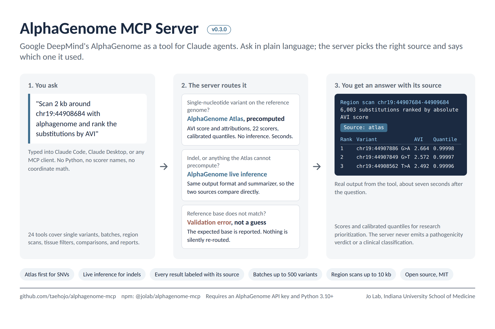

# AlphaGenome MCP Server



[](https://www.npmjs.com/package/@jolab/alphagenome-mcp)
[](https://opensource.org/licenses/MIT)

AlphaGenome as a tool for Claude agents. A Model Context Protocol (MCP) server that lets an agent turn a researcher's question into an AlphaGenome analysis.

## Demo

Three minutes in Claude Code, with the published package and the real API. The video has no sound.

https://github.com/user-attachments/assets/85e8eca5-af22-4f1a-9707-daf4c488d1cd

| Time | Prompt | What happens |
|---|---|---|
| 0:15 | `Use alphagenome to analyze chr19:44908684 T>C (APOE rs429358)` | A single-nucleotide variant: answered from the Atlas, with the AVI score |
| 1:10 | `Now analyze the 2 bp deletion chr17:49210289 CCC>C` | The Atlas cannot hold an indel: live inference, and the result says so. A live result has no AVI score |
| 2:10 | `Scan chr19:44907684-44909684 with alphagenome and show the 10 substitutions with the largest predicted impact` | 6,003 substitutions ranked from the Atlas without running the model |

The explanations in the video are written by Claude from the tool results. The tools themselves return scores and calibrated quantiles, and never a pathogenicity call.

## Overview

A researcher asks a question; the agent decides which AlphaGenome calls answer it, runs them, and reads the results back. This server gives the agent the two ways AlphaGenome can be asked:

- **The AlphaGenome Atlas** for single-nucleotide variants. The Atlas holds precomputed predictions for every possible single-nucleotide substitution in the human genome, so a lookup answers in seconds and a whole region can be ranked without running the model.
- **Live inference** for indels and other variants the Atlas cannot precompute.

The server chooses between the two automatically, and **every result states its source** (`source: atlas` or `source: live`), so a precomputed score is never mistaken for a fresh model call or the other way round.

**Key Features:**
- **Atlas first**: single-nucleotide variants are answered from the precomputed Atlas; live inference runs only when it is needed
- **Always says where the answer came from**: `source: atlas`, `source: live`, or `source: live (atlas fallback: <reason>)`
- **One shape for both sources**: live inference uses the SDK's `score_variant` with its recommended variant scorers, which have the same names as the Atlas scorers, so an Atlas result and a live result can be read side by side
- **AVI score and its attributions**: the AlphaGenome Variant Impact score (`AVI_SCORE`) and its feature attributions are first-class outputs for single-nucleotide variants
- **Region scans without the model**: rank every substitution in a region by the AVI score
- **24 tools**: 4 Atlas tools and 20 variant tools

> **These are model predictions for research prioritization, not clinical classifications.** Every tool reports AlphaGenome's scores and calibrated quantiles as returned. No tool classifies a variant as pathogenic or benign, assigns a risk label, or states a percent change, on either path. Not for diagnosis or treatment decisions.

## ⚡ Quick Start

**Get started in 3 minutes:**

0. **Get an API key** at https://alphagenome.google/api (free for non-commercial use). You need Node.js 18+ and Python 3.10+.

1. **Install dependencies**
   ```bash
   pip install alphagenome numpy
   ```
   If this fails, or you are on Windows, use a virtual environment: see [Python environment](#python-environment).

2. **Add to your MCP client** (supports Claude Code, Claude Desktop, Gemini CLI, Cursor, Windsurf)
   ```bash
   claude mcp add alphagenome --env ALPHAGENOME_API_KEY=YOUR_API_KEY -- npx -y @jolab/alphagenome-mcp@latest
   ```

   See [Installation](#installation) for other MCP clients.

3. **Run your first query**

   Restart your MCP client and try:
   ```
   "Use alphagenome to analyze chr19:44908684T>C"
   ```

4. **View results**

   This is a single-nucleotide variant, so it is answered from the Atlas in a few seconds and the report starts with `Source: atlas`. An indel would run live inference instead (typically 3-10 seconds) and say `Source: live`.

**Want more?** Check out the [24 tools](#available-tools) below.

## Architecture

### System Design

AlphaGenome MCP Server implements a multi-tier architecture:

```
┌─────────────────────────┐
│  Researcher             │
└───────────┬─────────────┘
            │ Natural language query
            ↓
┌─────────────────────────┐
│  Claude Desktop         │ ← MCP Client
└───────────┬─────────────┘
            │ JSON-RPC over stdio
            ↓
┌─────────────────────────┐
│  MCP Server (TypeScript)│ ← Tool routing, validation
└───────────┬─────────────┘
            │ subprocess
            ↓
┌─────────────────────────┐
│  Python Bridge          │ ← Interface to AlphaGenome SDK
└───────────┬─────────────┘
            │ HTTP
            ↓
┌─────────────────────────┐
│  AlphaGenome API        │ ← Google DeepMind's service
└─────────────────────────┘
```

### Atlas or live inference

| | AlphaGenome Atlas | Live inference |
|---|---|---|
| What it answers | Single-nucleotide substitutions on hg38 (chr1-22, chrX, chrY) | Any single variant: single-nucleotide, indel, multi-nucleotide |
| How | Looks up precomputed scores | Runs the AlphaGenome model |
| Typical time | 2-5 seconds per variant, about 7 seconds for a 2,000 bp region | 3-10 seconds per variant |

Six tools choose between the two on their own: `predict_variant_effect`, `batch_score_variants`, `assess_pathogenicity`, `batch_pathogenicity_filter`, `generate_variant_report` and `explain_variant_impact`. They take an optional `source` parameter:

| `source` | Behaviour |
|---|---|
| `auto` (default) | Atlas when `ref` and `alt` are single bases on chr1-22, chrX or chrY; live inference otherwise. If the Atlas does not hold the variant, falls back to live inference and says so: `source: live (atlas fallback: <reason>)` |
| `atlas` | Atlas only. Never falls back; a variant the Atlas cannot answer is an error |
| `live` | Always runs the model |

The fallback is deliberately narrow. It happens only when the Atlas reports that it does not hold the variant. Authentication, rate limit, network and timeout errors are returned as errors, and so is a variant the Atlas rejects: if the reference base does not match hg38, the Atlas says which base it expected, and the server passes that message on instead of running the model on a mistyped variant. In a batch, each variant is routed on its own and the result reports how many came from each source and how many fell back. A mixed batch is reported as two separately ranked groups: the Atlas group is ranked by the AVI score by default, live inference has no AVI score, so one merged ranking would compare different quantities.

### Two primitives, one shape

Every tool is a view over two primitives: *score one variant* and *score many variants and rank them*. Each is answered by the Atlas or by live inference, and both return the same thing: for each scorer, a matrix of rows (the variant, or one row per gene or junction) by tracks (tissues, cell types, assays), with a calibrated quantile for every score.

```
Atlas            client.query_variant(variant, requested_scorers=[...])
Live inference   client.score_variant(interval, variant, RECOMMENDED_VARIANT_SCORERS[...])
                 -> {scorer: AnnData}  ->  one shared summarizer  ->  ranked rows + source
```

The scorer names are the same on both sides (`RNA_SEQ`, `CAGE`, `DNASE`, `CHIP_HISTONE`, `CHIP_TF`, `SPLICE_SITES`, ...). The AVI scorers are the exception: the Atlas alone serves them. For chr17:49210289 C>T the two sources agree on the strongest track of five of the six default scorers, with scores that are close but not identical (DNASE in HeLa-S3: 2.778 from the Atlas, 2.846 live; CAGE in HeLa-S3: 1.866 and 2.121).

A matrix is never returned. One variant is thousands of numbers per scorer, so every result is the strongest cells, ranked, with the gene, tissue and assay of each.

### Input Validation

All inputs undergo validation before API submission:
- Chromosomes: Pattern-matched for chr1-22, chrX, chrY
- Positions: Validated as positive integers
- Alleles: A/T/G/C nucleotide validation
- Tissue types: UBERON ontology term validation

Invalid inputs return human-readable error messages, enabling conversational error recovery.

## Available Tools

### AlphaGenome Atlas

Precomputed scores, no model call. Every Atlas response is a summary: ranked rows, never a full score matrix. One variant alone is thousands of numbers per scorer (61 genes x 371 tracks for RNA-seq at the APOE locus), so responses are capped at `top_n` rows (default 25, maximum 100) and at 40,000 characters.

#### atlas_list_scorers
The scorers the Atlas serves (22 at the time of writing), with the number of tracks and the assays behind each. Cached for the session.
```
"Which scorers does the AlphaGenome Atlas have?"
```

#### atlas_lookup_variant
Scores of one single-nucleotide variant: the strongest tracks per scorer, ranked by absolute score, with the gene, tissue or cell type, and assay of each.
```
"Look up chr19:44908684 T>C in the AlphaGenome Atlas"
```

#### atlas_lookup_variants
Up to 500 single-nucleotide variants in one call, ranked by absolute score. Variants the Atlas does not hold, and variants it rejects (for example a reference base that does not match hg38), are listed separately with the reason instead of failing the whole call.
```
"Rank these 200 GWAS SNPs by their Atlas scores"
```

#### atlas_scan_region
Every possible single-nucleotide substitution in a region, ranked by absolute score. Answers "which positions in this region matter most?" without running the model. At most 10,000 bp; up to 50,000 bp only with `allow_large_region: true`.
```
"Scan chr17:49209289-49211289 and show the 10 substitutions with the largest predicted effect"
```

**Default scorers.** Override with the `scorers` parameter; names come from `atlas_list_scorers`.

| Used for | Default | Why |
|---|---|---|
| One variant (`atlas_lookup_variant`, `predict_variant_effect`) | `AVI_SCORE`, `RNA_SEQ`, `CAGE`, `DNASE`, `CHIP_HISTONE`, `CHIP_TF`, `SPLICE_SITES` | One representative scorer per modality: overall impact, expression, transcription start, accessibility, histone marks, TF binding, splicing |
| Many variants and regions (`atlas_lookup_variants`, `atlas_scan_region`, `batch_score_variants`) | `AVI_SCORE` | One number per variant makes the ranking meaningful and keeps the call inside the API's request quota. Measured on a 2,000 bp scan: `AVI_SCORE` 2 s, `DNASE` 17 s, `CHIP_TF` 86 s |

For `batch_score_variants`, the `scoring_metric` picks the Atlas scorer when `scorers` is not given: `rna_seq` uses `RNA_SEQ`, `splice` uses `SPLICE_SITES`, `regulatory_impact` and `combined` use `AVI_SCORE`.

**The AVI score.** The AlphaGenome Variant Impact (AVI) score combines AlphaGenome's predictions with AlphaMissense and other features into one number per variant. The Atlas serves it through the API as three scorers, and this server treats them as first-class outputs:

| Scorer | What it is |
|---|---|
| `AVI_SCORE` | The score itself, one value per variant, with its calibrated quantile. The default for ranking many variants and for region scans |
| `AVI_SCORE_FEATURE_IMPORTANCE` | The contribution of each of the 18 features to the score (`MAX_ABS_DNASE`, `MERGED_SPLICING`, `ALPHAMISSENSE`, `PHASTCONS_470_WAY`, ...). Shown by `generate_variant_report` and `explain_variant_impact` |
| `AVI_SCORE_MODEL_FEATURES` | The values of those 18 features |

The AVI score exists for single-nucleotide variants only, because only the Atlas serves it. A live result has no AVI score, and says so rather than approximating one. Scores and quantiles are reported exactly as returned; they are not turned into a pathogenic or benign call.

**Limits to know about.**
- The Atlas API has a requests-per-minute quota, and a region scan uses one request per 32 bp. That is why a scan is limited to 10,000 bp unless `allow_large_region` is set. Long scans wait and retry when the quota is hit. If the time limit (`ALPHAGENOME_TIMEOUT_MS`) is reached first, the partial result is returned, marked `Incomplete`, with the range that was really scanned; it is never silently truncated.
- Scorers with one row per gene or junction (`RNA_SEQ`, `SPLICE_JUNCTIONS`, ...) return more data per request than the API allows for a region scan. Scan with `AVI_SCORE` first, then look up the top variants with `atlas_lookup_variant`.
- Human reference genome (hg38) only. Positions are 1-based.

### Tools that choose between the Atlas and live inference

All six take `source` (`auto`, `atlas`, `live`) and `scorers`.

#### predict_variant_effect
The strongest tracks of each modality for one variant, with score, quantile, gene, tissue and assay. From the Atlas the AVI score is included. Optional `output_types` and `tissue_type`.
```
"Use alphagenome to analyze chr19:44908684T>C"
```

#### batch_score_variants
Up to 100 variants, each routed on its own, ranked by predicted effect. Reports how many came from each source and how many fell back.
```
"Use alphagenome to score these 50 variants and show the top 10"
```

#### assess_pathogenicity
Predicted effect size across modalities, and the AVI score from the Atlas. **The name is kept for compatibility: it does not classify.** `classification` is always `null`.
```
"Use alphagenome to assess rs429358"
```

#### batch_pathogenicity_filter
Keeps the variants whose largest absolute quantile reaches `threshold` (default 0.99), ranked, per source. **A filter on predicted effect size, not on pathogenicity.**
```
"Use alphagenome to keep the variants above the 99.9th percentile"
```

#### generate_variant_report
A fuller report of one variant: more rows per scorer and, from the Atlas, the AVI score with its feature attributions. **A research summary, not a clinical report: no classification, no recommendation.**
```
"Use alphagenome to generate a report for rs429358"
```

#### explain_variant_impact
Plain sentences that restate the numbers: the AVI score and its largest contributions, then the strongest effect of each modality ordered by quantile, with the direction for signed scorers. **Descriptive only.**
```
"Use alphagenome to explain the predicted effect of rs429358"
```

### Live-inference tools

These run `score_variant` and work for single-nucleotide variants, indels and multi-nucleotide variants. Every result states `source: live`. Tools that take one variant accept an optional `tissue_type` (a name such as `brain`, or an ontology CURIE such as `UBERON:0000955`).

| Tool | What it returns |
|---|---|
| `predict_splice_impact` | Splice sites, splice site usage and splice junctions, with the gene and junction of each |
| `predict_expression_impact` | RNA-seq (log fold change per gene and tissue) and CAGE |
| `predict_tf_binding_impact` | TF ChIP-seq, with the factor and cell type of each track |
| `predict_chromatin_impact` | ATAC-seq and DNase-seq |
| `predict_allele_specific_effects` | Alternate against reference allele: `RNA_SEQ` is that log fold change; `RNA_SEQ_ACTIVE` gives the expression level |
| `annotate_regulatory_context` | Every regulatory modality at once, to see where the predicted effect concentrates |
| `predict_tissue_specific` | The strongest effect of each scorer within each of several tissues |
| `compare_variants` | Two variants side by side, and which has the larger quantile per scorer |
| `compare_protective_risk` | The same comparison with the caller's labels; the tool does not judge which allele is protective |
| `compare_alleles` | The alternate alleles of one position, ranked |
| `analyze_gwas_locus` | The variants of a locus, ranked |
| `compare_variants_same_gene` | Variants ranked by their effect on one gene (`gene_name`) |
| `batch_modality_screen` | Variants ranked within one modality: `expression`, `splicing`, `tf_binding` or `chromatin` |
| `batch_tissue_comparison` | One ranking per tissue |

Rankings over several scorers use the largest absolute quantile, because quantiles are calibrated and the raw scores of different scorers are not on one scale. A ranking over one scorer uses its absolute score.

## Installation

### Requirements

- Node.js ≥18.0.0
- Python ≥3.10 (required by the `alphagenome` package)
- `alphagenome` ≥0.9.0 for the Atlas tools
- AlphaGenome API key: https://alphagenome.google/api (free for non-commercial use)
- Python packages: `alphagenome`, `numpy`

### Environment variables

| Variable | Purpose |
|---|---|
| `ALPHAGENOME_API_KEY` | Your API key. Put it in the `env` block of the MCP client configuration. This is preferred over `--api-key`, which leaves the key in the process list and in shell history |
| `ALPHAGENOME_PYTHON` | Python interpreter to use, for example a virtualenv (`/path/to/venv/bin/python`) or, on Windows, `C:\path\to\venv\Scripts\python.exe`. Without it the server tries `python3`, then `python` |
| `ALPHAGENOME_TIMEOUT_MS` | Time allowed for one call, in milliseconds (default 180000). Raise it for large region scans and batches |

### Python environment

The server runs the AlphaGenome Python SDK in a subprocess, so it needs a Python 3.10+ interpreter that has `alphagenome` installed. A virtual environment is the reliable way to get one: it avoids the "externally managed environment" error of system Pythons on macOS and Linux, and on Windows, where `python3` usually does not exist and `python` is often not on the PATH, it gives you a path to point at.

```bash
# macOS / Linux
python3 -m venv ~/.alphagenome-venv
~/.alphagenome-venv/bin/pip install alphagenome numpy
```
```powershell
# Windows (PowerShell)
py -3 -m venv $HOME\.alphagenome-venv
& $HOME\.alphagenome-venv\Scripts\pip install alphagenome numpy
```

Then tell the server which interpreter to use with `ALPHAGENOME_PYTHON`:

```bash
claude mcp add alphagenome \
  --env ALPHAGENOME_API_KEY=YOUR_API_KEY \
  --env ALPHAGENOME_PYTHON=/Users/you/.alphagenome-venv/bin/python \
  -- npx -y @jolab/alphagenome-mcp@latest
```

In a JSON configuration it goes in the same `env` block as the key (use the full path; on Windows, double the backslashes):

```json
"env": {
  "ALPHAGENOME_API_KEY": "YOUR_API_KEY",
  "ALPHAGENOME_PYTHON": "C:\\Users\\you\\.alphagenome-venv\\Scripts\\python.exe"
}
```

If `alphagenome` is installed for the `python3` (or `python`) on your PATH, you can skip `ALPHAGENOME_PYTHON`.

### Setup

**1. Install Python dependencies** (or use the virtual environment above):
```bash
pip install alphagenome numpy
```

**2. Configure for your MCP client:**

<details>
<summary><b>Claude Code</b></summary>

```bash
claude mcp add alphagenome --env ALPHAGENOME_API_KEY=YOUR_API_KEY -- npx -y @jolab/alphagenome-mcp@latest
```

This writes the server to `~/.claude.json`. Add `--scope project` to write it to `.mcp.json` in the current project instead.

**Test:**
```
"Use alphagenome to analyze chr19:44908684T>C"
```
</details>

<details>
<summary><b>Claude Desktop</b></summary>

Add to `claude_desktop_config.json`:
- macOS: `~/Library/Application Support/Claude/claude_desktop_config.json`
- Windows: `%APPDATA%\Claude\claude_desktop_config.json`

```json
{
  "mcpServers": {
    "alphagenome": {
      "command": "npx",
      "args": ["-y", "@jolab/alphagenome-mcp@latest"],
      "env": { "ALPHAGENOME_API_KEY": "YOUR_API_KEY" }
    }
  }
}
```

**Test:**
```
"Use alphagenome to analyze chr19:44908684T>C"
```
</details>

<details>
<summary><b>Gemini CLI</b></summary>

Add to `~/.gemini/settings.json`:
```json
{
  "mcpServers": {
    "alphagenome": {
      "command": "npx",
      "args": ["-y", "@jolab/alphagenome-mcp@latest"],
      "env": { "ALPHAGENOME_API_KEY": "YOUR_API_KEY" }
    }
  }
}
```

**Test:**
```
"Use alphagenome to analyze chr19:44908684T>C"
```
</details>

<details>
<summary><b>Cursor</b></summary>

Add to `.cursor/mcp.json` in your project root:
```json
{
  "mcpServers": {
    "alphagenome": {
      "command": "npx",
      "args": ["-y", "@jolab/alphagenome-mcp@latest"],
      "env": { "ALPHAGENOME_API_KEY": "YOUR_API_KEY" }
    }
  }
}
```

**Test:**
```
"Use alphagenome to analyze chr19:44908684T>C"
```
</details>

<details>
<summary><b>Windsurf</b></summary>

Add to your Windsurf settings JSON:
```json
{
  "mcpServers": {
    "alphagenome": {
      "command": "npx",
      "args": ["-y", "@jolab/alphagenome-mcp@latest"],
      "env": { "ALPHAGENOME_API_KEY": "YOUR_API_KEY" }
    }
  }
}
```

**Test:**
```
"Use alphagenome to analyze chr19:44908684T>C"
```
</details>

### Verification

1. Check that the client can start the server. In Claude Code:
   ```bash
   claude mcp list
   ```
   `alphagenome: ... ✔ Connected` means the server starts. It does not yet prove that Python and the key work; the first query does.
2. Restart your MCP client and ask:
   ```
   "Use alphagenome to analyze chr19:44908684T>C"
   ```
   Expected: a report that starts with `Source: atlas` within a few seconds. An indel (for example `chr17:49210289 CCC>C`) says `Source: live` and typically takes 3-10 seconds.

### Troubleshooting

The server reports problems as tool errors and keeps running. The message tells you which case you are in:

| Message | Cause and fix |
|---|---|
| `No Python interpreter found (tried: python3, python)` | No Python on the PATH of the MCP client. Set `ALPHAGENOME_PYTHON` to the full path of an interpreter (see [Python environment](#python-environment)). Common on Windows |
| `AlphaGenome package not installed for this interpreter (...)` | The interpreter in the message has no `alphagenome`. Install it for that interpreter, or point `ALPHAGENOME_PYTHON` at the one that has it. `pip install` fails on Python older than 3.10 |
| `AlphaGenome API key is missing` | Put `ALPHAGENOME_API_KEY` in the `env` block of the client configuration. Get a key at https://alphagenome.google/api |
| `API key error: ...` | The key was rejected. Check for a truncated or expired key |
| `reference base does not match the expected reference base: X` | The `ref` allele is not what hg38 has at that position. Check the genome build (hg38, not hg19), that the position is 1-based, and the strand. The message names the base the reference has |
| `request quota ... is exhausted` / `Rate limit exceeded` | The API's per-minute quota. Wait a minute; scan a smaller region |
| `timed out after 180000 ms` | A large scan or batch. Raise `ALPHAGENOME_TIMEOUT_MS`, or ask for less |
| `This alphagenome installation has no Atlas client` | `pip install --upgrade alphagenome` (0.9.0 or newer) |

**Tip:** say "use alphagenome" in a query when the client does not pick the server on its own.

## Usage Examples

All examples are actual results from the API (September 2026) for the two APOE variants that define the ε4 and ε2 alleles.

### One variant, from the Atlas

```
User: "Use alphagenome to assess rs429358" (chr19:44908684 T>C)
```
```json
{
  "source": "atlas",
  "variant": "chr19:44908684:T>C",
  "avi_score": { "score": 0.4999, "quantile": 0.9869896 },
  "strongest_effects": [
    { "scorer": "RNA_SEQ", "score": -0.038891, "quantile": -0.9996803, "where": "APOE, psoas muscle, polyA plus RNA-seq" },
    { "scorer": "CAGE", "score": 0.077866, "quantile": 0.9774153, "where": "pons, hCAGE" },
    { "scorer": "DNASE", "score": 0.12269, "quantile": 0.9463574, "where": "brain, DNase-seq" },
    { "scorer": "CHIP_HISTONE", "score": 0.13507, "quantile": 0.9953638, "where": "H3K27me3, common myeloid progenitor, CD34-positive, Histone ChIP-seq" },
    { "scorer": "CHIP_TF", "score": -0.16594, "quantile": -0.9972084, "where": "MYC, K562, TF ChIP-seq" },
    { "scorer": "SPLICE_SITES", "score": 0.022699, "quantile": 0.9561927, "where": "APOE" }
  ],
  "largest_abs_quantile": 0.9996803,
  "classification": null
}
```

### The same variant, explained

```
User: "Use alphagenome to explain the predicted effect of rs429358"
```
```
AlphaGenome Variant Impact (AVI) score: 0.4999 (quantile 0.9869896).
Largest contributions to the AVI score: CACTUS_241_WAY (0.2944), PHASTCONS_470_WAY (0.14471), ALPHAMISSENSE (0.029138).
RNA_SEQ: largest predicted effect in APOE, psoas muscle, polyA plus RNA-seq, score -0.038891, quantile -0.9996803 (negative: predicted lower with the alternate allele than the reference).
CHIP_TF: largest predicted effect in MYC, K562, TF ChIP-seq, score -0.16594, quantile -0.9972084 (negative: ...).
...
```

### An indel, by live inference

```
User: "Use alphagenome to analyze the deletion chr17:49210289 CCC>C"
```
```
**Variant**: chr17:49210289:CCC>C
**Source**: live
**Note**: Live inference because: deletion (CCC>C); the Atlas covers single-nucleotide substitutions only.

## RNA_SEQ
61 row(s) x 371 track(s); largest absolute score 0.8843, median 9.28e-4.

| Score | Quantile | Where |
|---|---|---|
| -0.8843 | -0.9999997 | ABI3, cardiac atrium fibroblast, total RNA-seq |
```

### The same SNV from both sources

chr17:49210289 C>T with `source: atlas` and with `source: live`, strongest track per scorer:

| Scorer | Atlas: score (quantile), where | Live: score (quantile), where |
|---|---|---|
| RNA_SEQ | 0.8612 (0.9999993), ABI3, LHCN-M2 | 0.9677 (0.9999996), ABI3, HFFc6 |
| CAGE | 1.866 (0.9999712), HeLa-S3 | 2.121 (0.9999838), HeLa-S3 |
| DNASE | 2.778 (0.9998919), HeLa-S3 | 2.846 (0.9999024), HeLa-S3 |
| CHIP_HISTONE | 1.846 (0.9999757), H3K27ac, HeLa-S3 | 1.967 (0.9999808), H3K27ac, HeLa-S3 |
| CHIP_TF | 1.675 (0.9999024), POLR2A, HeLa-S3 | 1.785 (0.9999371), POLR2A, HeLa-S3 |
| SPLICE_SITES | 0.06445 (0.9875146), GNGT2 | 0.04785 (0.9813679), GNGT2 |

The numbers are close, not identical: the Atlas was computed ahead of time and the live call runs the model now.

### Two variants side by side

```
User: "Use alphagenome to compare APOE rs429358 and rs7412"
```
```json
{
  "source": "live",
  "variants": [
    { "label": "variant1", "variant": "chr19:44908684:T>C",
      "effects": [ { "scorer": "RNA_SEQ", "score": -0.037954, "quantile": -0.9996693, "where": "APOE, psoas muscle, polyA plus RNA-seq" }, "..." ] },
    { "label": "variant2", "variant": "chr19:44908822:C>T",
      "effects": [ { "scorer": "RNA_SEQ", "score": 0.035793, "quantile": 0.9997013, "where": "APOE, endothelial cell of umbilical vein, polyA plus RNA-seq" }, "..." ] }
  ],
  "larger_abs_quantile_by_scorer": { "RNA_SEQ": "variant2", "...": "..." }
}
```

### Tissue-specific

```
User: "Use alphagenome to compare rs429358 in brain and liver"
```
In brain the strongest RNA-seq effect is on APOE (score -0.0084, quantile -0.9943216); DNase-seq in brain is 0.1224 (quantile 0.9463574) and in liver -0.004807 (quantile -0.1842174).

### Filtering a mixed batch

```
User: "Use alphagenome to keep the variants above the 99th percentile: rs429358, rs7412, and the deletion chr17:49210289 CCC>C"
```
The two SNVs are answered from the Atlas and ranked by the AVI score (rs7412: 0.8636, quantile 0.995461, kept; rs429358: quantile 0.9869896, not kept). The deletion is answered by live inference (largest quantile 0.9999997, kept). The result reports the two groups separately: `"source": "mixed"`, `"answered_from": { "atlas": 2, "live": 1, "atlas_fallback": 0 }`.

## Performance

- **Atlas**: 2-5 seconds per variant, about 7 seconds for a 2,000 bp region scan (with `AVI_SCORE`)
- **Live inference**: typically 3-10 seconds per variant (measured through the server, September 2026; depends on API load)
- **Modalities**: 11 (RNA-seq, CAGE, PRO-cap, splice sites, DNase, ATAC, histone mods, TF binding, contact maps)

## Development

### Build from Source

```bash
git clone https://github.com/taehojo/alphagenome-mcp.git
cd alphagenome-mcp
npm install
pip install -r requirements.txt
npm run build
```

### Project Structure

```
src/
├── index.ts              # MCP server entry point
├── alphagenome-client.ts # API client (Python bridge, timeout, interpreter choice)
├── routing.ts            # Atlas or live inference: the rule, as pure functions
├── variant-tools.ts      # The 20 variant tools, over two primitives and a narrow backend interface
├── tools.ts              # MCP tool definitions
├── types.ts              # TypeScript type definitions
├── tests/                # Unit tests (no API key needed)
└── utils/
    ├── config.ts         # Environment variables
    ├── validation.ts     # Input validation (Zod schemas)
    └── formatting.ts     # One set of formatters for both sources, and the size cap
scripts/
├── alphagenome_bridge.py # Bridge: one JSON request in, one JSON response out
├── atlas_actions.py      # Atlas lookups and region scans
├── live_actions.py       # Live inference with score_variant
├── summaries.py          # The summarizer shared by both sources (numpy only)
└── tests/                # Python unit tests for the summarizer
```

### Testing

```bash
npm test               # Build, then run the TypeScript unit tests (no API key needed)
npm run test:python    # Python unit tests for the shared summarizer (numpy and pandas only)
npm run docs:api       # Regenerate docs/API.md from the tool definitions in src/tools.ts
npm run lint           # ESLint check
npm run typecheck      # TypeScript type checking
npm run build          # Compile to build/
```

## Roadmap

Not in this release, and not promised by any tool above:

- **Combinations of variants**: scoring several variants together on one haplotype, rather than one at a time.
- **Custom sequences**: predictions for a sequence the caller supplies, rather than a variant on the reference genome.

Both need live inference and neither can be precomputed, so they fit the same design: the Atlas where it can answer, the model where it cannot, and the source on every result.

## Read more

[From a microglia gene to a variant map in about 60 seconds](docs/media/explainer.png): a longer, illustrated explainer of the research workflow this server came from, asking which non-coding variants near *ABI3* change its expression.

## Citation

If you use this software in your research, please cite:

```bibtex
@software{jo2025alphagenome_mcp,
  author = {Jo, Taeho},
  title = {AlphaGenome MCP Server},
  year = {2025},
  url = {https://github.com/taehojo/alphagenome-mcp},
  version = {0.2.0}
}
```

AlphaGenome model:
```bibtex
@article{avsec2025alphagenome,
  title = {AlphaGenome: advancing regulatory variant effect prediction with a unified DNA sequence model},
  author = {Avsec, Žiga and Latysheva, Natasha and Cheng, Jun and others},
  journal = {bioRxiv},
  year = {2025}
}
```

## Acknowledgments

- **Google DeepMind** for developing and providing access to the AlphaGenome API
- **Anthropic** for developing the Model Context Protocol specification and Claude Desktop

## License

MIT License - Copyright (c) 2025 Taeho Jo

See [LICENSE](LICENSE) file for details.

## Links

- **npm Package**: https://www.npmjs.com/package/@jolab/alphagenome-mcp
- **GitHub Repository**: https://github.com/taehojo/alphagenome-mcp
- **AlphaGenome**: https://deepmind.google/discover/blog/alphagenome/
- **Model Context Protocol**: https://modelcontextprotocol.io/
- **Claude Desktop**: https://claude.ai/download
